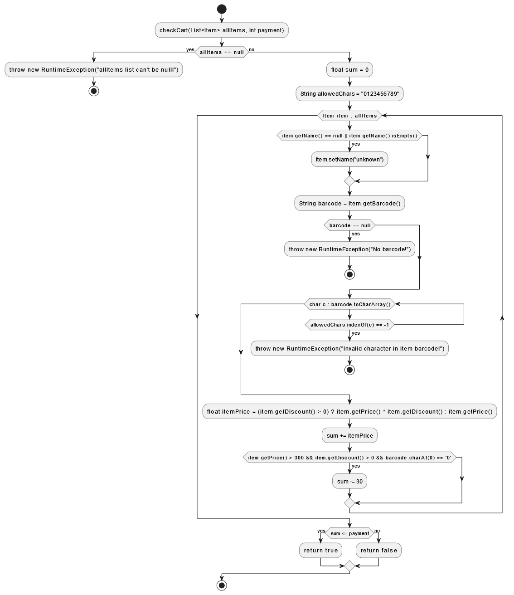

# SI_2024_lab2_226111

## Андреј Васовски, бр. на индекс 226111

###  Control Flow Graph



### Цикломатска комплексност

Цикломатската комплексност на овој код е 7, истата ја добив преку формулата E−N+2P, каде што N=19 е бројот на предикатни јазли, E=24 е бројот на edges. Во случајoв P=1, па цикломатската комплексност изнесува 7.

### Тест случаи според критериумот Every Branch

Во овој случај се проверува кога листата e null и функцијата фрла Exception.
```java
@Test
void testAllItemsNull() {
    Throwable exception = assertThrows(RuntimeException.class, () -> SILab2.checkCart(null, 0));
    assertEquals("allItems list can't be null!", exception.getMessage());
}
```

Во овој случај се тестира празна листа со доволна средства.

```java
@Test
void testEmptyListWithSufficientPayment() {
    List<Item> items = new ArrayList<>();
    assertTrue(SILab2.checkCart(items, 100));
}
```

Во овој случај се тестира листа со два производи за кои нема доволна средства.

```java
@Test
void testListItemWithInsufficientPayment() {
    Item testItem1 = new Item(null, "123", 100, 0);
    Item testItem2 = new Item("ItemName", "321", 50, 0);
    List<Item> items = new ArrayList<>();
    items.add(testItem1);
    items.add(testItem2);
    assertFalse(SILab2.checkCart(items, 10));
}
```

Во овој случај се тестира производ без баркод за кој функцијата фрла Exception.

```java
@Test
void testListItemWithNoBarcode() {
    Item testItem1 = new Item(null, null, 100, 0);
    Item testItem2 = new Item("ItemName", "321", 50, 0);
    List<Item> items = new ArrayList<>();
    items.add(testItem1);
    items.add(testItem2);

    Throwable exception = assertThrows(RuntimeException.class, () -> SILab2.checkCart(items, 10));
    assertEquals("No barcode!", exception.getMessage());
}
```

Во овој случај се тестира производ со баркод кои има недозволени карактери и за кој функцијата фрла Exception.

```java
@Test
void testListItemWithInvalidCharacter() {
    Item testItem1 = new Item(null, "123", 100, 0);
    Item testItem2 = new Item("ItemName", "1asd", 50, 0);
    List<Item> items = new ArrayList<>();
    items.add(testItem1);
    items.add(testItem2);

    Throwable exception = assertThrows(RuntimeException.class, () -> SILab2.checkCart(items, 10));
    assertEquals("Invalid character in item barcode!", exception.getMessage());
}
```
Во овој случај се тестира останатите јазли за кои не биле поминати во предходните тестови и се тестира специјланото намалување од 30 за кои треба да се задоволи: цената на производот да биде поголема од 300, намалението на производот да биде поголем од 0 и баркодот да почнува со 0. 

```java
@Test
void testListItemsWithNameTestWithDiscountTestWithAndSpecialDiscountTest() {
    Item testItem1 = new Item(null, "123", 100, 0);
    Item testItem2 = new Item("ItemName", "321", 50, 10);
    Item testItem3 = new Item("ItemName", "0321", 350, 10);
    List<Item> items = new ArrayList<>();
    items.add(testItem1);
    items.add(testItem2);
    items.add(testItem3);
    assertFalse(SILab2.checkCart(items, 10));
}
```
### Тест случаи според критериумот Multiple Condition

Во овој тест случај се проверува условот според Multiple Condition критериумот, каде секој производ го проверува условот поединечно, Првиот производ ја проверува цената помала од 300, Вториот ја проверува цената поголема од 300 но со намалениа еднакво на 0, третиот ги задоволува предходните барање но баркодот не почнува со 0, четвриот ги задоволува сите услови и со тоа ги поминува сите случаеви.

```java
@Test
void testListItemsMultipleConditionCriteria() {
    Item testItem1 = new Item(null, "123", 100, 0);
    Item testItem2 = new Item("ItemName2", "321", 350, 0);
    Item testItem3 = new Item("ItemName3", "321", 350, 10);
    Item testItem4 = new Item("ItemName4", "0123", 350, 10);
    List<Item> items = new ArrayList<>();
    items.add(testItem1);
    items.add(testItem2);
    items.add(testItem3);
    items.add(testItem4);
    assertTrue(SILab2.checkCart(items, 10000));
}
```